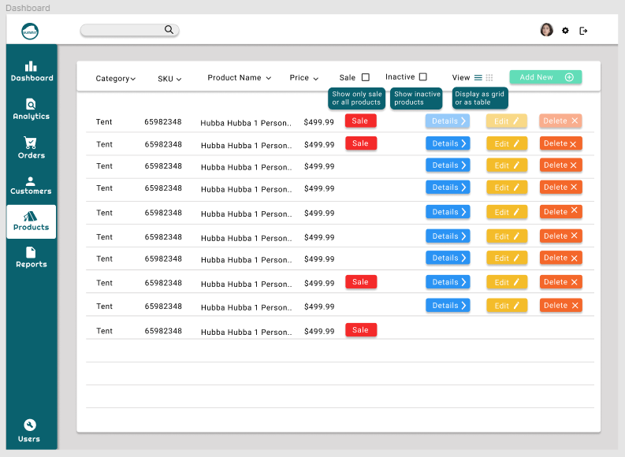

# SUMMIT Outdoor Supplies Dashboard

## Description
The SUMMIT Dashboard will be a one stop shop for retail management. As additional features are built out, the dashboard will be able to generate real-time displays of useful business data. Additionally, order and customer information will be tracked. The current functionality adds inventory management for the dashboard. The dashboard will
eventually be linked to the retail side of the website.

### Dependencies
The current project uses npm. The current bundler is parcel and sass is used for styles throughout. Firebase is used for database and storage (see package.json).

### Requirements Met in the Product Management System
All CRUD operations are executed using Firebase's Real Time Database (RTD)
and storage. 
### Issues to be Fixed/Features to be Added in the Product Management System
* Additional filtering/sorting of product data on the view page as per the 
  current appbar layout
* Potential addition of search functionality to quickly find products, orders, or      customers
* Addition of a togglable table view to quickly manage product data
   
* Additional visual tweaks to sidebar and overall design
* Addition of multiple image uploads per product to allow for multiple views
* Addition of more data fields as necessary or relevant to specific product categories
* Movement towards modal windows for view, edit, and delete functions
* Fixing of Chrome-only jitter that sometimes appears on forms when hovering over number
  fields

